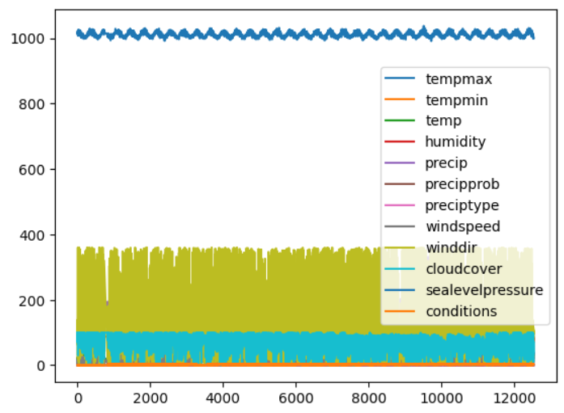

# Bài tập lớn môn học "Nhập môn Trí tuệ nhân tạo"
## Đề tài: Dự báo có mưa
## Phương pháp thực hiện
### Mô hình
Thuật toán: K-Nearest Neighbors
### Dữ liệu:
(link lấy data: https://www.kaggle.com/datasets/khinguyntin/hanoiweather1990-2024-data-from-visual-crossing)

- Thông tin Dữ liệu: 
Bộ dữ liệu có 12,539 dòng và 13 cột, bao gồm các thuộc tính liên quan đến thời tiết của Hà Nội qua nhiều năm.
Các cột chứa thông tin về ngày (datetime), nhiệt độ cao nhất (tempmax), nhiệt độ thấp nhất (tempmin), nhiệt độ trung bình (temp), độ ẩm (humidity), lượng mưa (precip), xác suất mưa (precipprob), loại mưa (preciptype), tốc độ gió (windspeed), hướng gió (winddir), độ che phủ mây (cloudcover), áp suất khí quyển ở mực nước biển (sealevelpressure), và điều kiện thời tiết (conditions).

### Tiền xử lý dữ liệu

Thiếu Dữ Liệu: Tất cả các ô NaN đã được loại bỏ hoặc thay thế bằng giá trị 0 (đối với cột precipt). Điều này đảm bảo rằng không có giá trị thiếu sẽ ảnh hưởng đến kết quả phân tích.
Giá Trị Bất Thường: Đã thực hiện kiểm tra và loại bỏ các giá trị ngoại lệ trong các cột nhiệt độ, giúp dữ liệu trở nên đáng tin cậy hơn cho phân tích.
Biến Đã Được Chuyển Đổi: Cột 'preciptype' đã được dán nhãn với hai giá trị là '0' (không có mưa) và '1' (có mưa). Cột ‘conditions’ được dán nhãn không thứ tự, thể hiện theo sự đặc trưng của từng giá trị.
Biểu Đồ Phân Phối: Nhìn vào biểu đồ, ta thấy nhiệt độ có xu hướng tập trung vào một khoảng nhất định, cho thấy tính đồng nhất trong dữ liệu.
Khả Năng Phân Tích: Với dữ liệu đã được tiền xử lý, ta có thể tiến hành phân tích thống kê để tìm hiểu mối quan hệ giữa các yếu tố như nhiệt độ và độ ẩm đối với khả năng xuất hiện mưa.

### Huấn luyện
- Khởi tạo: Cấu hình thuật toán K-NN

Dữ liệu được chia ngẫu nhiên thành 2 tập train và test theo tỉ lệ 80-20.

Tham số huấn luyện k:
- Start: 25
- End: 115
- Step: 10

## Kết quả

Kết quả huấn luyện:

Ma trận nhầm lẫn:

Kết quả tốt nhất trên tập test:
- Accuracy: 0.68196
- k = 55

### Thư viện sử dụng
- Wandb: theo dõi quá trình huấn luyện
